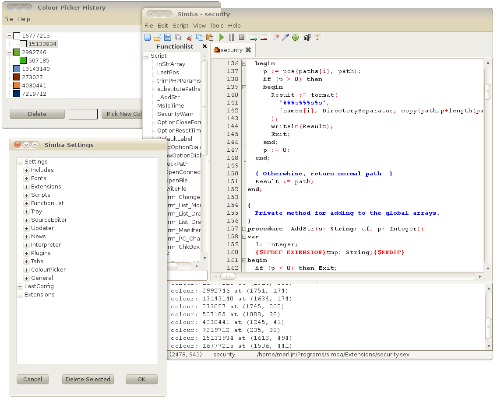
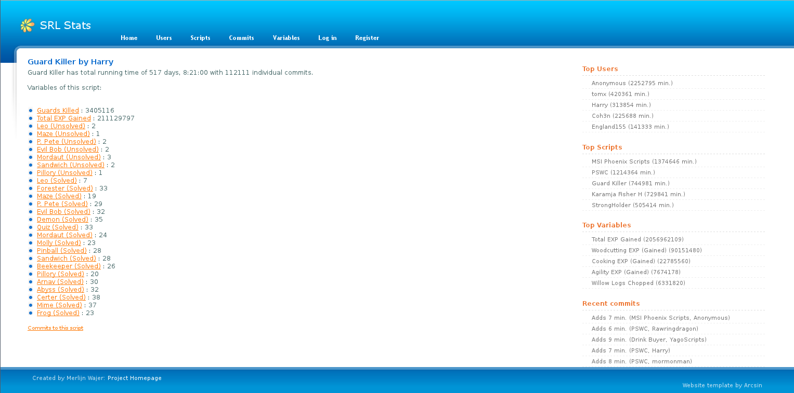
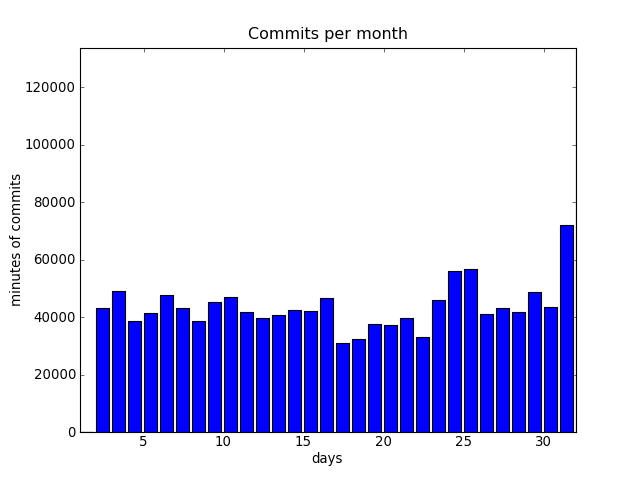
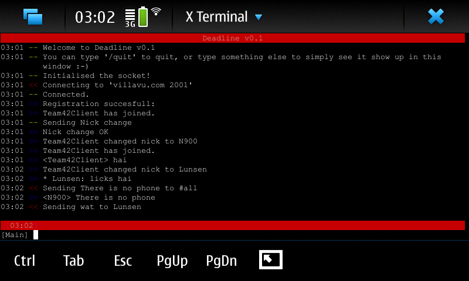

.. Wizzup documentation master file, created by
   sphinx-quickstart on Sun Jul 24 18:22:16 2011.
   You can adapt this file completely to your liking, but it should at least
   contain the root `toctree` directive.

Welcome to Wizzup.org
=====================

My name is Merlijn (Boris Wolf) Wajer; born in Amsterdam, 16 December 1990
I am 20 years old and currently attend the University of Amsterdam.

Projects
--------

Some of my projects will be quickly covered here, all my other small projects
can be found on my git hosts, `git.wizzup.org <http://git.wizzup.org/>`_ and my
`Github account <http://github.com/MerlijnWajer>`_.

SRL
~~~

`SRL <https://villavu.com/>`_ is the first project I ever participated in and it
has mainly been the base of my current programming knowledge. SRL was
initially a library created to macroing a game called *Runescape*, but has since
turned into a community full of interesting people, talented programmers and
generally cool fruitcakes. The library still works, by the
way. SRL has lots of *Scripts* that each perform their own task on *Runescape*.

Simba
~~~~~

`SRL`_ was initially interpreted by SCAR, a closed source program. When
development of SCAR stagnated and stability decreased, I - along with other
members of the SRL community - created `Simba <http://wizzup.org/simba>`_.
Originally created to closely resemble SCAR and to provide an Open Source
alternative to it, it has now superseded SCAR on `SRL`_. Simba is GPL-3
licensed.

    Simba running on my old Linux distribution, Ubuntu Linux.

SRL-Stats
~~~~~~~~~
`SRL-Stats <http://wizzup.org/stats>`_ was created to keep track of the progress
and use of SRL. SRL *Scripts* can gather statistics from their actions and
submit them to SRL stats.

Currently the most popular script has ran for
*954 days, 8:49:00 with 154756 individual commits.*, which is pretty impressive.

    The SRL Stats website as on http://stats.villavu.com

    An example of a graph generated by SRL stats, this is of the fifth month of
    2011.

πϱTorrent
~~~~~~~~~

`πϱTorrent <http://wizzup.org/pyroTorrent>`_ is a web interface to rTorrent. It
was written in Python because I got so fed up with all the crappy PHP
interfaces and generally just PHP being crappy.

It is still work in progress, but it can do some basic stuff like list
and add torrents.

.. figure:: img/pyrotorrent.png
    :scale: 40 %

    pyroTorrent showing my sheevaplug seedbox. (Note that none of these
    downloads are illegal, so bite me)

Oh, and `πϱTorrent`_ is really fast compared to any of the PHP web interfaces.

Distributed Chat System
~~~~~~~~~~~~~~~~~~~~~~~

`DCS <http://wizzup.org/dcs/>`_ was an assignment for the University of
Amsterdam, we had to form groups and implement a chat protocol similar to IRC.
Our implementation ended up being quite cool, with only one known bug. One that
we've never bothered to fix, though.

    The DCS ncurses client running on my Nokia N900.

Teaching
--------

I have been an assistant in some courses at the University of Amsterdam.

My page for students can be found `here <http://wizzup.org/teaching/>`_

.. toctree::
   :maxdepth: 2

