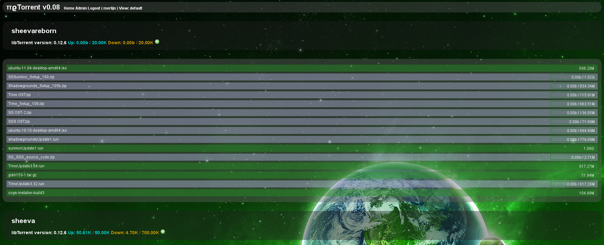

.. Wizzup documentation master file, created by
   sphinx-quickstart on Sun Jul 24 18:22:16 2011.
   You can adapt this file completely to your liking, but it should at least
   contain the root `toctree` directive.

Welcome to Wizzup.org
=====================

My name is Merlijn (Boris Wolf) Wajer; born in Amsterdam, 16 December 1990
I am 21 years old and currently attend the University of Amsterdam, currently
going for my Master of Science in Computational Science after finishing a
Bachelor of Science in Computer Science.

Blog
----

My blog can be found at http://blog.wizzup.org
I try to post there regularly, but so far that hasn ot worked out.
The blog is powered by `PWBlog`_.

Projects
--------

Some of my projects will be quickly covered here, all my other small projects
can be found on my git hosts, `git.wizzup.org <http://git.wizzup.org/>`_ and my
`Github account <http://github.com/MerlijnWajer>`_.

Projects I participate in:

    *   `SRL`_

Projects I have started:

    *   `Simba`_ (In collaboration with several SRL developers: Niels AD,
        Raymond van Venetië, Benjamin Land, John Peel)
    *   `SRL-Stats`_
    *   `πϱTorrent`_ (In collaboration with Bas Weelinck)
    *   `Tracy`_
    *   `Rubberfuse`_
    *   `uinput-mapper`_
    *   `Soxy`_
    *   `Least`_ (In collaboration with Bas Weelinck)
    *   `PWBlog`_
    *   `SNARP`_ (In collaboration with Antonio Ospite)

Tracy
~~~~~

Cross architecture System call tracing and injection framework for Linux (\*BSD
support will hopefully follow).

Initial project was for European Credits at the University of Amsterdam.
Most information can be found on the
`Git page <https://github.com/MerlijnWajer/tracy>`_; including the
documentation and our paper/report.

Soxy
~~~~

Transparent SOCKS5 Proxyfier based on `Tracy`_. See `Tracy`_ for more details.

uinput-mapper
~~~~~~~~~~~~~

`uinput-mapper <https://github.com/MerlijnWajer/uinput-mapper>`_ is a
simplistic but powerful project to create (virtual) input devices that can be
fed (and change) events from other input devices. Possible use cases:

- Creating virtual joysticks from a keyboard device. (For example: a device with
  physical joysticks that exposes keyboard device)
- Creating a mouse from joystick input.

Immature project, but works for my use cases. I mostly created this for an
arcade machine that exposed two joysticks as a single keyboard device.

    map program running

    /dev/input *before* the map program is running and while the map program is
    running.

Rubberfuse
~~~~~~~~~~

`Rubberfuse <https://github.com/MerlijnWajer/rubberfuse>`_ is a continuation of
the work done on Rubberhose-FS by Julian Assange et al.
Initially this project will focus on bringing a simplified version of Marutukku
using FUSE, but I plan to eventually switch to device-mapper and extend the
safety of the rubberhose-fs.

SRL
~~~

`SRL <https://villavu.com/>`_ is the first project I ever participated in and it
has mainly been the base of my current programming knowledge. SRL was
initially a library created to macroing a game called *Runescape*, but has since
turned into a community full of interesting people, talented programmers and
generally cool fruitcakes. The library still works, by the
way. SRL has lots of *Scripts* that each perform their own task on *Runescape*.

Simba
~~~~~

`SRL`_ is interpreted by a program called Simba, created by
members of the SRL community. `Simba <http://wizzup.org/simba>`_.
Simba can perform many kind of tasks, including faking mouse movements and key
presses, finding bitmaps and colours and reading text from the screen.

Simba is GPL-3 licensed and Open Source and Free Software.

    Simba running on my old Linux distribution, Ubuntu Linux.

SRL-Stats
~~~~~~~~~
`SRL-Stats <http://wizzup.org/stats>`_ was created to keep track of the progress
and use of SRL. SRL *Scripts* can gather statistics from their actions and
submit them to SRL stats.

Currently the most popular script has ran for
*954 days, 8:49:00 with 154756 individual commits.*, which is pretty impressive.

.. figure:: img/stats_site.png
    :scale: 25 %

    The SRL Stats website as on http://stats.villavu.com.
    The design was taken from some free templates site, as I stink at web design
    - at least for now.

.. figure:: img/stats.png
    :scale: 50 %

    An example of a graph generated by SRL stats, this is of the fifth month of
    2011.

πϱTorrent
~~~~~~~~~

`πϱTorrent <http://wizzup.org/pyroTorrent>`_ is a web interface to rTorrent. It
was written in Python because I got so fed up with all the crappy PHP
interfaces and generally just PHP being crappy.

It is still work in progress, but it can do some basic stuff like list
and add torrents, connect to multiple rtorrents at once, manage users,
basic login authentication.

    pyroTorrent showing my sheevaplug seedbox(e). (Note that none of these
    downloads are illegal, so bite me)

.. figure:: img/pyrotorrent2.png
    :scale: 25 %

    Login screen.

Oh, and `πϱTorrent`_ is really fast compared to any of the PHP web interfaces.

Least
~~~~~

The not so minimalisitic PDF viewer.

`Least <https://github.com/MerlijnWajer/least>`_ is a very simple OpenGL based
PDF viewer. We have some great features we wish to implement, but so far I
have not found the time.

SNARP
~~~~~

Simple Noise Activated Recording in Python.

`SNARP <https://github.com/MerlijnWajer/SNARP>`_ is a very simple noise activated
audio recording program. I initially wrote this for the Nokia N900, but it
should work on most Linux desktops.

.. figure:: img/snarp.png
    :scale: 70 %

    SNARP configuration

    Running SNARP

PWBlog
~~~~~~

More details will be available later.

Distributed Chat System
~~~~~~~~~~~~~~~~~~~~~~~

`DCS <http://wizzup.org/dcs/>`_ was an assignment for the University of
Amsterdam, we had to form groups and implement a chat protocol similar to IRC.
Our implementation ended up being quite cool, with only one known bug. One that
we've never bothered to fix, though.

.. figure:: img/dcs.png
    :scale: 50 %

    The DCS ncurses client running on my Nokia N900.

Other work
----------

I am an active member of `TechInc <http://techinc.nl>`_, the Amsterdam
Hackerspace. Projects I am working on (or have worked on) include:

-   The RGB LED wall. (`lewd <https://github.com/MerlijnWajer/lewd>`_
-   Fluff card game. (In development)

Aside from that I'm also working on some minor projects, including:

-   `Gollision <https://github.com/MerlijnWajer/Gollision>`_, a
    shoot em up game written in `Go <http://golang.org>`_. The code of this
    project is not particularly exciting and mostly just meant as an
    introduction to Go. Don't expect anything to come out of this project until
    I give it a lot more love.
-   Several small python snippets such as `unitable
    <https://github.com/MerlijnWajer/unitable>`_

Teaching
--------

I am (have been) an assistant in some courses at the University of Amsterdam
since 2009.

..
    My page for students can be found `here <http://wizzup.org/teaching/>`_
    
    .. toctree::
       :maxdepth: 2

Contact
-------

You can contact me by mailing me (merlijn) at this website; wizzup.org. (I'm
sure you can construct my email address by now, if you're a human anyway.)

Other Hobbies
-------------

I like messing around with Linux. In particular I've had a lot of fun with my
sheevaplug(s) running Gentoo Linux. As for sports; I've been practicing Aikido
since I was a child, with a few pauses. I also like reading and music
(Ambient, Classical, New Wave, Black Metal).
